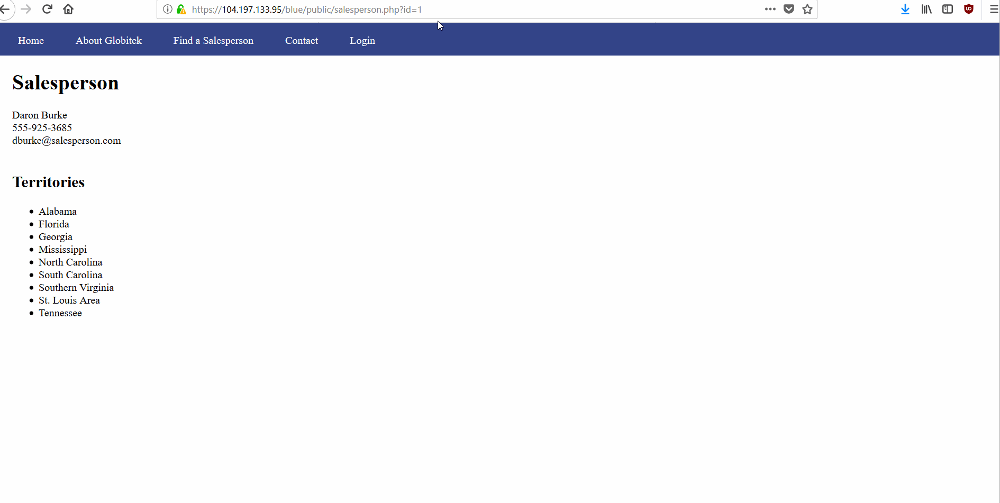
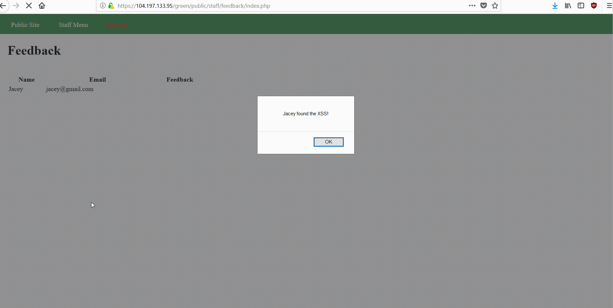
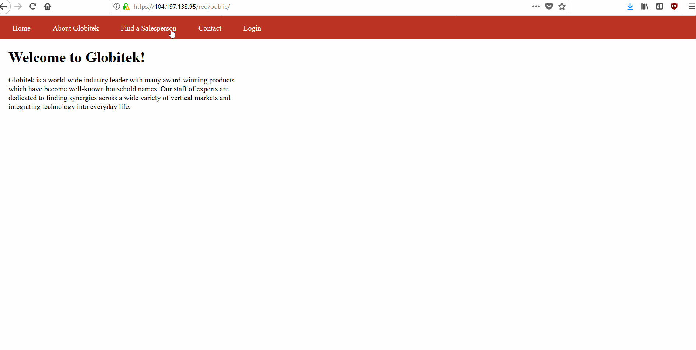
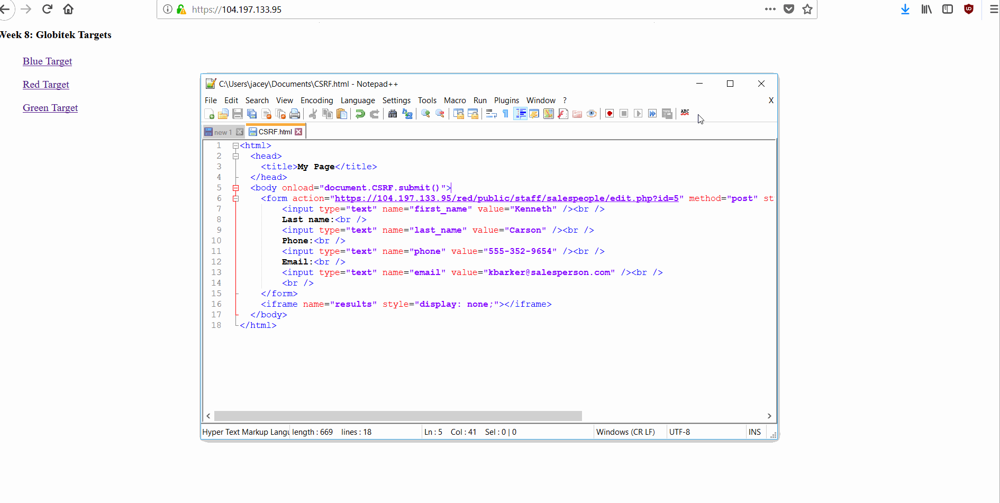

# Project 8 - Pentesting Live Targets

Time spent: **X** hours spent in total

> Objective: Identify vulnerabilities in three different versions of the Globitek website: blue, green, and red.

The six possible exploits are:
* Username Enumeration
* Insecure Direct Object Reference (IDOR)
* SQL Injection (SQLi)
* Cross-Site Scripting (XSS)
* Cross-Site Request Forgery (CSRF)
* Session Hijacking/Fixation

Each version of the site has been given two of the six vulnerabilities. (In other words, all six of the exploits should be assignable to one of the sites.)

## Blue

Vulnerability #1: SQL Injection - When on the public site, going to find a salesperson and selecting a salesperson shows the flaw. A single quote can be added to the URL and on the blue site the query is not sanitized. 

Vulnerability #2: Session Hijacking/Fixation - The blue site allow you to change the session ID based off the ID of a logged in user in another browser, and use that ID to log in on another browser without needing the log in credentials.

## Green

Vulnerability #1: User Enumeration - Signing in with a good username but bad password gives a bold error message. Logging in with a bad username and a bad password removes the bold. The mistake the developer made is changing the class name for the span which contains the error message. The class name is failed when it's a bad username, and the class name is failure when it's a good username but a bad password. The blue and red sites only use the failure class.

Vulnerability #2: Cross-Site Scripting - Leaving feedback on the contact tab of the public site with XSS will show up when logging in to the private site. 

## Red

Vulnerability #1: Insecure Direct Object Reference - On the red site when finding a salesperson, the salesperson id can be changed to chow id 10 which is noted as not being made public until September 1st.

Vulnerability #2: Cross-Site Request Forgery - On the red site someone could leave a link in a comment for feedback. The admin then follows that link which would run cross-site request forgery. In the example I did, I changed Ken Barker to Kenneth Carson (Barbie reference). 

## Notes

Describe any challenges encountered while doing the work
